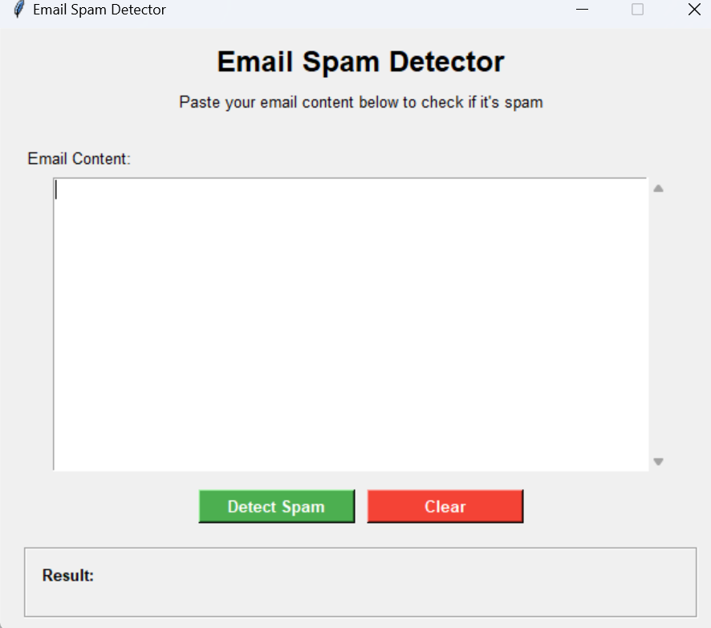
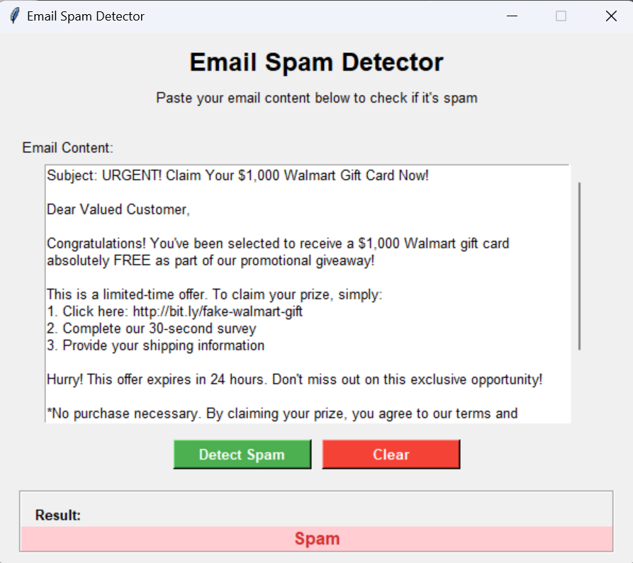
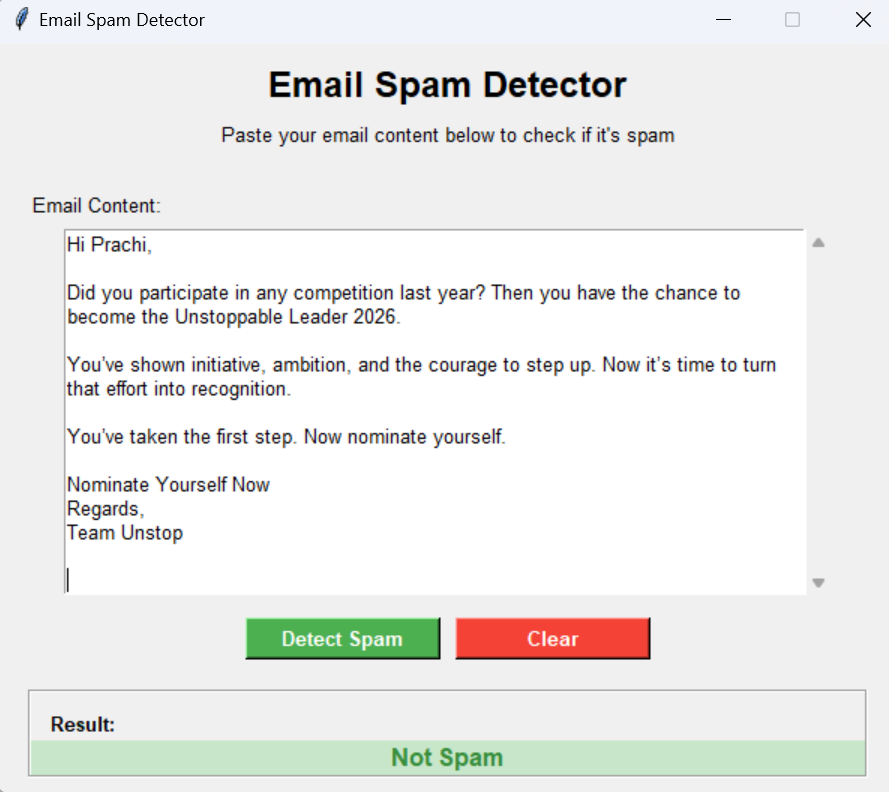

# 📧 Email Spam Detection using Python

## 📌 Project Overview

This project is a Machine Learning based Email Spam Detection system built using Python.
It classifies emails/messages as **Spam** or **Ham (Not Spam)** using a labeled dataset (`spamhamdataset.csv`).

The model learns patterns from the dataset and predicts whether a new email is spam or legitimate.

---


 
## 🚀 Features

* Load and preprocess email dataset
* Clean and transform text data
* Convert text into numerical features using NLP techniques
* Train Machine Learning classification model
* Predict whether an email is Spam or Ham
* Simple and beginner-friendly implementation

---

## 🛠️ Technologies Used

* Python
* Pandas
* NumPy


---

## 📂 Dataset

The project uses:

```
spamhamdataset.csv
```

Dataset contains:

* Email text/message
* Label (Spam / Ham)

---

## ⚙️ Installation & Setup

### 1️⃣ Clone the repository

```
git clone <your-repo-link>
cd <project-folder>
```

### 2️⃣ Install required libraries

```
pip install pandas numpy scikit-learn matplotlib seaborn
```

### 3️⃣ Run the project

```
python main.py
```

*(Replace `main.py` with your actual Python file name.)*

---

## 🧠 How It Works

1. Load the spam/ham dataset
2. Clean and preprocess the email text
3. Convert text into vectors using **TF-IDF / CountVectorizer**
4. Split data into training and testing sets
5. Train a classifier (Naive Bayes / Logistic Regression / etc.)
6. Evaluate accuracy
7. Predict new email messages

---

## 📊 Example Prediction

Input:

```
"Congratulations! You won a free lottery ticket"
```

Output:

```
Spam
```

---


## 📸 Output Screenshot

  
  
  

## 📁 Project Structure

```
Email-Spam-Detection/
│── spamhamdataset.csv
│── app.py.py
|___model.py
|___train_model.py
│── README.md
```

---

## 🎯 Future Improvements

* Add web interface using Flask / Streamlit
* Use Deep Learning model
* Deploy the model online
* Add email file upload feature

---

## 👩‍💻 Author

Prachi lembhe

---


